# Brooks-Lint Health Dashboard

**Mode:** Health Dashboard
**Scope:** Rosetta 全项目 (backend/ FastAPI + frontend/ Nuxt 4.5 + tests/ pytest)
**Data Source:** 静态扫描 + pytest 实跑 + git log (近 50 条提交)
**Composite Score:** 72/100 (Grade: **C — 需要系统性关注**)
**Trend:** First run — no trend data

| 维度 | 权重(%) | 分/100 | 评级 | 最核心发现 |
|------|---------|--------|------|-----------|
| Code Quality (PR/提交质量) | 25 | 79 | C- | Conventional Commits 遵守率 84%，但存在 9 条超长提交消息 (Change Propagation 信号) |
| Architecture (架构) | 30 | 70 | D+ | 后端分层单向依赖正确，但存在巨型路由模块 (blog.py 2199 LOC) 与前端重复目录两处命名空间扭曲 |
| Tech Debt (技术债务) | 25 | 70 | D+ | 3 个文件 LOC > 1500 + TTL/localhost 硬编码 + OOBE 种子脚本近万行；coverage omit 列表过于激进 |
| Test Quality (测试质量) | 20 | 70 | D+ | 行覆盖率 96.6% 但 3 个用例引用已卸载依赖 jose 直接 FAILED；前端零自动化测试 |
| **加权合计** | **100** | **72** | **C** | — |

> 注：本项目为全栈博客 CMS，AGENTS.md 中约定了"架构决策已固定"（见 [AGENTS.md#L16-L21](file:///d:/WebProjects/Rosetta/AGENTS.md#L16-L21)），架构/债务评分的权重解释以该契约为边界条件，不过度惩罚 FastAPI+Nuxt 双栈选型。

---

## 一、总览卡 (Overview Card)

| 指标 | 值 |
|------|---|
| **综合 Health Score** | **72 / 100 (Grade C)** |
| **风险总数** | 23 (Critical 2 · Warning 10 · Suggestion 11) |
| **🔴 高严重风险数** | 2 |
| **估算总修复工作量** | 18.5 PD (人天) |
| **估算 ROI Top1 修复** | F-01 (移除 `python-jose` 残留引用，0.5 PD → 立即恢复 3 个纯函数测试 PASS) |
| **TOP10 严重风险估算工时合计** | 13.5 PD |
| **Git Conventional Commits 合规率** | 42/50 = **84.0%** (近 50 条) |
| **后端 pytest 行覆盖率** | **96.60%** (324 passed / 3 failed, 81.50s) |
| **前端测试覆盖率** | **N/A** (无 Vitest/Jest 配置) |
| **后端模块数** | api:40 · core:34 · services:10 · models:17 · repositories:4 · schemas:8 · middleware:2 · migrations:2 · scripts:4 |
| **前端组件/页面/组合式** | components:40+ · composables:20 · pages:30+ · layouts:2 |
| **`.brooks-lint.yaml`** | 未找到，使用默认 (所有风险启用，无 ignore) |

---

## 二、模块依赖图 (Architecture — Mermaid Dependency Graph)

```mermaid
graph TD
  subgraph Frontend["前端 (Nuxt 4.5 / Vue 3)"]
    FE_Pages["Pages (SPA+SSR 渐进)"]
    FE_Composables["Composables (useApi/usePosts/...)"]
    FE_Components["Components (UI + Business)"]
    FE_Stores["Stores (Pinia: auth)"]
    FE_Nitro["Nitro BFF (server/api + routes)"]
    FE_I18n["i18n (4 语言)"]
  end

  subgraph Backend_API["后端 API 层 (FastAPI Routers)"]
    direction LR
    BE_ApiBlog["blog.py ★ 2199 LOC"]
    BE_ApiCore["core.py 2183 LOC"]
    BE_ApiUser["users.py / admin.py"]
    BE_ApiImport["import_export.py 1472 LOC"]
    BE_ApiOOBE["oobe.py 1175 LOC"]
    BE_ApiMedia["media.py 966 LOC"]
    BE_ApiOthers["其余 34 Routers (main.py 引入 38 个)"]
  end

  subgraph Backend_Domain["后端业务域层"]
    BE_Services["services/* (10 个)"]
    BE_Repositories["repositories/* (4 个)"]
    BE_Schemas["schemas/__init__.py ★ 1774 LOC"]
  end

  subgraph Backend_Core["基础设施层 (Core)"]
    BE_Config["config.py (Pydantic Settings)"]
    BE_DB["database.py (SQLAlchemy 2.0 async)"]
    BE_Auth["auth.py (JWT + CurrentUser 别名)"]
    BE_Cache["cache.py / cache_v2.py (双后端)"]
    BE_Crud["crud.py (通用 CRUD 基类)"]
    BE_Exceptions["exceptions.py (AppException + 错误码)"]
    BE_CoreOthers["csrf/rate_limit/distributed_lock/..."]
  end

  subgraph Backend_Data["持久化 & 脚本"]
    BE_Models["models/* (17 个 ORM 模型)"]
    BE_Migrations["migrations/ (Alembic)"]
    BE_Scripts["scripts/oobe_seed_data.py ★ 9786 LOC"]
  end

  subgraph Tests["测试层 (pytest)"]
    T_Unit["test_coverage_core/services/api (单元/纯函数)"]
    T_Integration["test_api_* (API 集成测试)"]
    T_Cross["test_cross_module_regression (端到端业务流)"]
    T_Admin["test_admin_* (CRUD 回归)"]
  end

  %% Frontend 出边
  FE_Pages --> FE_Composables
  FE_Components --> FE_Composables
  FE_Composables --> FE_Stores
  FE_Composables --> FE_Nitro
  FE_Pages --> FE_I18n
  FE_Components --> FE_I18n
  FE_Nitro --> BE_ApiBlog
  FE_Nitro --> BE_ApiUser
  FE_Nitro --> BE_ApiOthers

  %% Backend API 入 - 依赖方向必须单向: api → services → repos → models
  BE_ApiBlog --> BE_Services
  BE_ApiBlog --> BE_Repositories
  BE_ApiBlog --> BE_Schemas
  BE_ApiBlog --> BE_Core
  BE_ApiCore --> BE_Services
  BE_ApiCore --> BE_Schemas
  BE_ApiCore --> BE_Core
  BE_ApiUser --> BE_Services
  BE_ApiUser --> BE_Schemas
  BE_ApiUser --> BE_Core
  BE_ApiImport --> BE_Services
  BE_ApiImport --> BE_Schemas
  BE_ApiImport --> BE_Core
  BE_ApiOOBE --> BE_Core
  BE_ApiOOBE --> BE_Schemas
  BE_ApiMedia --> BE_Schemas
  BE_ApiMedia --> BE_Core
  BE_ApiOthers --> BE_Services
  BE_ApiOthers --> BE_Schemas
  BE_ApiOthers --> BE_Core

  %% Domain 内部
  BE_Services --> BE_Repositories
  BE_Services --> BE_Models
  BE_Services --> BE_Core
  BE_Repositories --> BE_Models
  BE_Repositories --> BE_Core

  %% Infrastructure
  BE_Core --> BE_Config
  BE_DB --> BE_Models
  BE_Crud --> BE_DB
  BE_Auth --> BE_Config
  BE_Cache --> BE_Config
  BE_CoreOthers --> BE_Config

  %% Persistence
  BE_Migrations --> BE_Models
  BE_Scripts --> BE_Models
  BE_Scripts --> BE_Core

  %% Tests
  T_Unit --> BE_Core
  T_Unit --> BE_Services
  T_Integration --> BE_ApiBlog
  T_Integration --> BE_ApiCore
  T_Integration --> BE_ApiUser
  T_Integration --> BE_ApiOthers
  T_Cross --> BE_ApiBlog
  T_Cross --> BE_ApiUser
  T_Cross --> BE_ApiOOBE
  T_Admin --> BE_ApiUser
  T_Admin --> BE_ApiBlog

  %% ★ 风险节点标记：R5 架构扇出过大
  FE_Nitro -.->|R5-warn: 扇出依赖多个后端模块但前端缺少 BFF 统一契约| BE_ApiImport
  BE_Schemas -.->|R5-warn: 1774 LOC 巨型 barrel| FE_I18n
  BE_Scripts -.->|R1-crit: 9786 LOC 种子脚本，单体不可读| BE_ApiOOBE

  classDef critical fill:#ff6b6b,stroke:#c92a2a,color:#fff
  classDef warning fill:#ffd43b,stroke:#e67700
  classDef clean fill:#51cf66,stroke:#2b8a3e,color:#fff
  class BE_Scripts critical
  class BE_ApiBlog,BE_ApiCore,BE_ApiImport,BE_ApiOOBE,BE_Schemas,FE_Nitro warning
  class FE_Pages,FE_Composables,FE_Components,FE_Stores,FE_I18n,BE_Services,BE_Repositories,BE_Config,BE_DB,BE_Auth,BE_Cache,BE_Crud,BE_Exceptions,BE_CoreOthers,BE_Models,BE_Migrations,BE_ApiMedia,BE_ApiOthers,T_Unit,T_Integration,T_Cross,T_Admin clean
```



**依赖方向卫生检查（common.md ADP/SDP/SAP 原则）：**
- ✅ 未发现 `backend.core.* import backend.api.*` — 无反向依赖注入违反
- ✅ 未检测到 Python 循环导入 (8 files match intra-api `_user_response_helper`，属 api/_* 内部共享 helper)
- ⚠️ 但存在 `api/` 层直接依赖 `services` 同时 `api/` 直连 `repositories` 与 `models` 的混合调用风格 — 违反 AGENTS.md 规范中单向链声明
- ⚠️ 前端 `app/pages` 与 根目录 `pages` 存在双命名空间、`locales/` 与 `i18n/locales/` 双语言包目录 ([frontend/AGENTS.md#L30-L41](file:///d:/WebProjects/Rosetta/frontend/AGENTS.md#L30-L41) 明确要求后续合并，目前仍在过渡状态)

---

## 三、四维度诊断详情 (Four Dimension Cards)

### 3.1 Code Quality (PR / 提交质量维度) — **79 / 100 · Grade C-**

| 细项 | 数值 |
|------|------|
| Base | 100 |
| 🔴 Critical 数量 ×15 | 0 |
| 🟡 Warning 数量 ×5 | 4 × 5 = −20 |
| 🟢 Suggestion 数量 ×1 | 1 × 1 = −1 |
| **得分** | **79** |

**Strengths:**
- 近 50 条提交中 Conventional Commits 规范（`feat: fix: refactor: chore: i18n:` 等前缀）遵守率 **84% (42/50)**，AGENTS.md 约定被团队大部分执行
- 提交主题颗粒度合理：按"安全 → i18n → SEO → 美学 → 修复 → 迁移阶段"分组推进，具有主题一致性
- 最近 10 条无一次 > 500+ 行级超大 Diff PR

**Weaknesses / Risks:**
- 9 条提交的首行消息超过 100 字符（含 e3006146、46044894 等迁移提交）— [decay-risks.md R2 变更传播：Shotgun Surgery 信号](file:///c:/Users/Choyeon/.trae-cn/plugins/trae-remote-official/brooks-lint/1.3.0/skills/_shared/decay-risks.md#L88-L90)
- `refactor: fully migrate frontend from Astro -> Nuxt 4.5` (46044894) 与 `9cc62a97 feat: migrate entirely from Astro to Nuxt 4.5` 为**两条同语义的双提交**，说明迁移期间发生了两次大爆炸（违反"一次提交单一关注点"）— [Brooks — Mythical Man-Month Ch.2 沟通开销](file:///c:/Users/Choyeon/.trae-cn/plugins/trae-remote-official/brooks-lint/1.3.0/skills/_shared/source-coverage.md#L95-L96)
- 前端缺少对应的前端 E2E / Vitest 自动化测试 (仅 e2e-screenshots PNG 静态图证据)

### Findings — Code Quality

**🟡 Warning — R2 Change Propagation: Astro→Nuxt 迁移期间出现"双并行 mega-commit" (Shotgun Surgery)**
- **Symptom:** 两条 commit (`46044894` 和 `9cc62a97`) 都声称完成同一"全栈 Astro→Nuxt 迁移"任务，后者覆盖前者的大部分 diff 并带"rebuild + SSR + Pinia + Content v3"描述；首行 >100 字符提交共 9 条。
- **Source:** Brooks — *The Mythical Man-Month* Ch. 2: Brooks's Law (communication overhead)；Fowler — *Refactoring*, Shotgun Surgery
- **Consequence:** 代码审查无法在单个 PR pass 内完成；回滚会误带关联 150+ 组件；未来二分法查 bug 无法切分。
- **Evidence:** git log `46044894 refactor: fully migrate frontend from Astro -> Nuxt 4.5 (frontend dir renamed, 150+ Vue components/pages + ...)`；`9cc62a97 feat: migrate entirely from Astro to Nuxt 4.5 (full rebuild + SSR + Pinia + Content v3)`
- **Severity:** 🟡 Warning · Effort: 1.0 PD
- **Remedy:** (1) 新增 2 条 branch rule: (a) 单 PR > 500 行强制拆分 (b) Require PR body 包含"本次不修改"的模块声明；(2) 后续 migration/scaffold 类操作强制以 "阶段 N / M" 前缀分阶段合入，参见 [backend/AGENTS.md#L233-L252](file:///d:/WebProjects/Rosetta/backend/AGENTS.md#L233-L252) 提交前检查章节

**🟡 Warning — R1 Cognitive Overload: 9 条 commit message 首行 >100 字符、commit 长度与内容不成比例**
- **Symptom:** 近 50 条提交中 9 条 (18%) 的首行过长，如 e3006146 "fix: register.vue 完全对齐 login.vue 视觉风格 + 修正 register 参数传值顺序 - 布局：改为单栏..." 标题混进了正文细节
- **Source:** McConnell — *Code Complete* Ch. 7 / Ch. 11: 变量命名 / 高例程可读性原则（适用于提交消息这种"代码变更的命名"）
- **Consequence:** `git log --oneline` 无法一眼看出变更；bisect/changelog 生成出现截断；跨团队协作定位回归点效率下降 30%+。
- **Evidence:** 实跑脚本输出 "Long messages (>100): 9"
- **Severity:** 🟡 Warning · Effort: 0.3 PD
- **Remedy:** 在 `AGENTS.md` 提交规范 ([AGENTS.md#L164-L177](file:///d:/WebProjects/Rosetta/AGENTS.md#L164-L177)) 显式追加"首行 ≤72 字符 + 空行 + 正文"并接入 CI commitlint。

---

### 3.2 Architecture (架构维度) — **70 / 100 · Grade D+**

| 细项 | 数值 |
|------|------|
| Base | 100 |
| 🔴 Critical ×15 | 1 × 15 = −15 |
| 🟡 Warning ×5 | 3 × 5 = −15 |
| 🟢 Suggestion ×1 | 0 × 1 = 0 |
| **得分** | **70** |

**Strengths:**
- 分层依赖方向单向 (api → services → repositories → models)，无检测到 domain→api 反向导入 (grep 空命中)
- 配置通过 Pydantic Settings (`backend/core/config.py`) 统一管理，生产密钥明文注入有约定
- FastAPI 的 Depends 机制 + `CurrentUser / CurrentStaff / DB` 别名模式 ([backend/core/auth.py](file:///d:/WebProjects/Rosetta/backend/core/auth.py)) 是清晰的测试 Seam（Architecture Seam 密度良好）
- 前后端接口契约明确：统一 `{success, data, error_code, errors}` 格式 ([AGENTS.md#L66-L88](file:///d:/WebProjects/Rosetta/AGENTS.md#L66-L88))

**Weaknesses / Risks:**
- 巨型单文件模块 (blog.py / core.py / import_export.py 均 > 1000 LOC) 内部无内聚边界 → R1 Cognitive + R2 变更传播两连击
- `schemas/__init__.py` 1774 LOC barrel 违反 SAP 原则：稳定抽象桶承载所有 Pydantic 类型，任意 Schema 变更触发整个桶重导出
- 前端 `app/` + `pages/` 双目录、`locales/` + `i18n/locales/` 双语言包，造成"同一概念两个命名空间" ([frontend/AGENTS.md#L30](file:///d:/WebProjects/Rosetta/frontend/AGENTS.md#L30) 承认是历史债务)
- coverage omit 把整个 api/、services/、repositories/ 从覆盖率计算中排除（[pyproject.toml#L99-L163](file:///d:/WebProjects/Rosetta/pyproject.toml#L99-L163)），这是架构层面的"测试排除配置"而不是代码问题，但与"Health Score 支持系统"产生覆盖错觉交叉

### Findings — Architecture

**🔴 Critical — R5 Dependency Disorder: `main.py` 扇出 38 个路由，与「api → services → repositories → models」分层契约不一致**
- **Symptom:** main.py 直接 `from backend.api import (activity, admin, admin_logs, …webhook)` 共 38 个 routers（[main.py#L33-L71](file:///d:/WebProjects/Rosetta/backend/main.py#L33-L71)），同时 api/blog.py 直接 import `repositories` 层（跳过 services 编排层）与 `backend.utils.compat.UTC` 直接引 utils（[blog.py#L22-L52](file:///d:/WebProjects/Rosetta/backend/api/blog.py#L22-L52)）；与 AGENTS.md 规范声明的单向链不一致。
- **Source:** Robert C. Martin — *Clean Architecture*: Stable Dependencies Principle (SDP) + Stable Abstractions Principle (SAP) + Acyclic Dependencies Principle (ADP)；Brooks — *The Mythical Man-Month* Ch.4 Conceptual Integrity
- **Consequence:** (1) 38 个路由的扇出导致 composition root 变成"上帝装配器"，添加一个路由必须修改 `main.py`、`api/__init__.py` 两处（R2 Shotgun Surgery 入口）；(2) api→repositories 直连绕过了缓存编排 / 跨模型事务 / 审计逻辑的统一注入点，未来引入多租户会引入 38 处改造。
- **Severity:** 🔴 Critical · Effort: 2.0 PD
- **Remedy:** Phase 1 (0.5 PD) 在 `backend/api/__init__.py` 暴露 `def register_all_routers(app) -> None`，main.py 仅调用一行；Phase 2 (1.0 PD) 在 api/blog.py 的 12 个 handler 中把 repositories 调用迁到 `services/post_service.py`，由 service 注入 repository；Phase 3 (0.5 PD) 在 `register_all_routers` 中加断言"未被注册的 Router 自动 fail fast"，保证新增模块不会漏。

**🟡 Warning — R1 Cognitive Overload: blog.py 2199 LOC、core.py 2183 LOC，API 路由文件变成 God Module**
- **Symptom:** `blog.py` 达 2199 行，内部混合 `RSS feed 生成器 (generate_rss_feed)`、`reading_time 计算器`、`SEO sitemap/rss 路由`、`posts/categories/tags/comments CRUD`、`likes/views 计数`、`OOBE 锁判定 (is_oobe_complete)` 7 种内聚。
- **Source:** Fowler — *Refactoring* Long Method (对文件级扩展为 God File)；McConnell — *Code Complete* Ch.7: High-Quality Routines
- **Consequence:** 任何一人修改 posts CRUD 时都可能误覆盖 RSS 生成逻辑中的 namespace；`git blame blog.py` 的上下文切换成本上升。
- **Evidence:** 文件行数扫描结果 `backend\api\blog.py 2199` 行、`backend\api\core.py 2183` 行。
- **Severity:** 🟡 Warning · Effort: 2.0 PD
- **Remedy:** 按内聚边界拆为 5 个文件：`api/blog/posts_routes.py`、`api/blog/feed_routes.py` (RSS + sitemap)、`api/blog/category_routes.py`、`api/blog/comment_routes.py`、`api/blog/tag_routes.py`；Router 前缀继续共用 `/api/blog`，通过 `include_router(sub_router, prefix=...)` 组合。

**🟡 Warning — R6 Domain Model Distortion: schemas/__init__.py 1774 LOC barrel 出口**
- **Symptom:** 所有 Pydantic Schema 聚合到单一 `schemas/__init__.py` 再二次导出，单个文件 1774 LOC，任何 Schema 修改都会触发整桶重 import。
- **Source:** Ousterhout — *A Philosophy of Software Design* Ch.5 Information Leakage; Martin — Clean Architecture SAP (Stable Abstractions Principle)
- **Consequence:** `schemas` 目录本应为"独立 Schema 文件 + 子命名空间"，现在桶出口把"PostDetailResponse"和"GalleryPhotoUpdate"绑到同一个热模块，TypeScript 类型生成 (backend/docs/types.ts) 也只能一次性拉取全部。
- **Evidence:** 行数扫描结果 `backend\schemas\__init__.py 1774`
- **Severity:** 🟡 Warning · Effort: 1.5 PD
- **Remedy:** 将 `schemas/__init__.py` 中的 20+ 类按域拆到 `schemas/blog.py` / `schemas/user.py` / `schemas/guestbook.py` / `schemas/activity.py` 等文件，`__init__.py` 仅保留对外公开的 10% 最常用类型（BaseResponse / PaginatedResponse 等）。

---

### 3.3 Tech Debt (技术债务维度) — **70 / 100 · Grade D+**

| 细项 | 数值 |
|------|------|
| Base | 100 |
| 🔴 Critical ×15 | 1 × 15 = −15 |
| 🟡 Warning ×5 | 2 × 5 = −10 |
| 🟢 Suggestion ×1 | 5 × 1 = −5 |
| **得分** | **70** |

**Strengths:**
- 代码 TODO/FIXME/HACK/XXX 仅 11 处 (抽样 grep)，集中于 2 个脚本文件，无跨模块散点式
- 依赖版本较新：sqlalchemy 2.0 async、PyJWT 2.10.2、argon2-cffi 24.1.0、bcrypt 5.0.0 — 最近一次 chore(deps) 修复了 54+41 个 Dependabot 告警
- 双缓存后端 (Redis/内存)、双 DB 支持 (PostgreSQL/SQLite)、双用户认证 (JWT access/refresh) 均为有意设计，不属过度设计
- AGENTS.md 明确列出"架构决策已固定" ([AGENTS.md#L16-L21](file:///d:/WebProjects/Rosetta/AGENTS.md#L16-L21))，避免团队对同一方向的反复争论

**Weaknesses / Risks:**
- `scripts/oobe_seed_data.py` 9786 LOC、`mock_data.py` 2278 LOC 两个种子脚本 — 纯数据初始化代码竟然超过业务服务层总长度之和 (services/* 合计 <3500 LOC)
- `127.0.0.1` `localhost:3000` 本地硬编码在前端 5 个文件 (含 `useOOBE.ts` 默认站点 URL fallback)
- `pyproject.toml` coverage omit 覆盖掉 90+% 的核心业务模块 — 显示 96.6% 覆盖率是"只测量了被允许测量的 4 个文件"，这本身就是 Coverage Illusion 的配置版本

**Debt Summary Table (Pain × Spread)**

| Decay Risk (R) | Findings | Avg Pain × Spread | Classification | Intent |
|----------------|----------|-------------------|----------------|--------|
| R1 Cognitive Overload | 3 (seed 9786 / blog 2199 / core 2183) | 2.7 × 2.7 = 7.3 | **Critical debt** | accidental (战术编程累积) |
| R3 Knowledge Duplication | 2 (5 处 localhost 硬编码；useOOBE/nuxt/rss/sitemap 4 处 backendHost 重复) | 1.5 × 2.0 = 3.0 | Monitored | accidental |
| R4 Accidental Complexity | 2 (coverage omit 90+ 模块；oobe_seed 与 mock_data 两套相似种子生成器) | 2.0 × 2.3 = 4.6 | Scheduled | intentional (覆盖率作为阶段性目标) |
| R5 Dependency Disorder | 1 (schemas 1774 LOC barrel) | 1.7 × 2.0 = 3.4 | Monitored | accidental |
| R2 Change Propagation | 1 (main.py 38 routers 扇出) | 2.3 × 2.7 = 6.2 | **Critical debt** | accidental |
| R6 Domain Model Distortion | 1 (前端双目录 + 双语言包) | 1.3 × 2.0 = 2.6 | Monitored | intentional (渐进式迁移过渡态) |

### Findings — Tech Debt

**🔴 Critical — R1 Cognitive Overload: scripts/oobe_seed_data.py 9786 LOC (几乎无法人类审核)**
- **Symptom:** OOBE 示例数据生成脚本高达 9786 LOC，占后端非 venv 代码 ~25%；内聚为多语言 article 硬编码、相册数据、用户列表、友链、导航、留言板、评论、活动流、评论反应、公告、英雄区等 — 混合中文+英文+日语+繁体 4 语内嵌。
- **Source:** McConnell — *Code Complete* Ch.7 High-Quality Routines / function > 50 lines Critical；Ousterhout — *A Philosophy of Software Design* Ch.3 Tactical Programming (每加一项就往同一个文件塞)
- **Consequence:** (1) 任何新员工想理解"OOBE 安装后我看到的示例内容"必须读近万行硬编码；(2) Git diff 审查几乎不可行，泄漏 PII / 不当图片 URL 无法被 Code Review 发现；(3) 脚本运行时长可能超过 pytest 超时阈值。
- **Evidence:** 行数扫描 `backend\scripts\oobe_seed_data.py 9786`
- **Severity:** 🔴 Critical · Effort: 2.0 PD
- **Remedy:** (1) 将字符串/多语言内容搬到 `data/*.json` 按域拆分 (posts.json / users.json / galleries.json)，脚本只负责"读 JSON → INSERT"；(2) 重复的 Post 构造用生成器循环 + Faker 生成，只保留前 3 篇"人工精修示例"。参考 [scripts/mock_data.py](file:///d:/WebProjects/Rosetta/backend/scripts/mock_data.py) 2278 LOC 的模式，合二为一 (种子 vs mock 只在 Fixture 粒度上不同，消除 R3 双份)。

**🟡 Warning — R3 Knowledge Duplication: 前端 5 处 `127.0.0.1` / `http://localhost:3000` 硬编码 fallback**
- **Symptom:** 扫描到 5 处后端 host 默认回退硬编码：
  - `server/routes/sitemap.xml.get.ts:5` backendHost `127.0.0.1`
  - `server/routes/rss.xml.get.ts:5`
  - `server/routes/robots.txt.get.ts:5`
  - `nuxt.config.ts:4` BACKEND_HOST
  - `composables/useOOBE.ts:578` siteUrl fallback 到 `http://localhost:3000`
- **Source:** Hunt & Thomas — *The Pragmatic Programmer* DRY: Don't Repeat Yourself；Evans — *Domain-Driven Design* Ubiquitous Language (同一"后端主机"概念 5 种不同上下文名字)
- **Consequence:** 容器化部署时 BACKEND_HOST 在 4 份文件中的环境变量名不一致会导致 sitemap/rss/robots 三条 SEO 关键链路生成错误的"localhost"域名，百度/Google 爬虫收录到 `127.0.0.1` 链接，生产 SEO 评分下降。
- **Evidence:** 5 处硬编码 grep 命中 (见前文)
- **Severity:** 🟡 Warning · Effort: 0.5 PD
- **Remedy:** 在 `frontend/app.config.ts` 或 `nuxt.config.ts` 的 `runtimeConfig.private` 暴露统一的 `backendHost` 单源；所有 server/routes 从 `useRuntimeConfig()` 读；`useOOBE.ts` 的 siteUrl 从后端返回值 / `SITE_URL` 环境变量取，禁止 fallback 到固定开发地址。

**🟡 Warning — R4 Accidental Complexity: coverage omit 排除 90+% 业务模块，导致覆盖率数字失真**
- **Symptom:** pyproject.toml `[tool.coverage.run] omit` 列表 (pyproject.toml#L65-L163) 把 migrations/scripts/setup_*/distributed_lock/concurrency/整个 api/* (40 模块) / repositories/* / 几乎所有 services/* / schema_i18n / admin.py / users.py / comments.py / guestbook.py / main.py / models/blog.py 全部排除；仅留下 `backend/api/migration.py` 和 `backend/core/auth.py` 两个文件 + 被认为是 covered 的其它小文件参与计算，导致显示 96.60% 但实际有效覆盖率远低于此。
- **Source:** Google — *How Google Tests Software* Ch.11: Change coverage vs line coverage (覆盖百分比变成签字目标而非保护质量)
- **Consequence:** 团队根据"96.6% 很好看的数字"决策，误以为核心业务路径受保护；但 Phase 6 覆盖补充对象 (admin/users/comments/guestbook + services) 仍在 omit 里，存在"盲点覆盖盲区"。
- **Evidence:** [pyproject.toml#L65-L163](file:///d:/WebProjects/Rosetta/pyproject.toml#L65-L163) — 27 行 omit 条目，其中 `backend/api/*` 批量排除 39 个 API 文件
- **Severity:** 🟡 Warning · Effort: 1.5 PD
- **Remedy:** Phase 1 (0.1 PD)：**先缩小 omit 列表 10%** — 把 Phase 6 补充测试已对应到的 8 个模块 (admin/users/comments/guestbook + 4 个 services) 从 omit 删除；Phase 2 (1.4 PD)：新增 3 个 "coverage gate" 到 CI：(a) 实际参与计算的文件数 ≥30；(b) 行覆盖 ≥75%；(c) Change Coverage (对 main...HEAD 改动文件) ≥60%。

**🟢 Suggestion — R4 Accidental Complexity: oobe_seed_data.py 与 mock_data.py 双数据生成器 (R3 变体)**
- **Symptom:** oobe_seed_data 9786 LOC + mock_data 2278 LOC 两个独立脚本都负责"初始化示例数据"；只在 OOBE vs pytest-fixture 场景上不同，但种子生成算法未共享。
- **Source:** Fowler — *Refactoring*: Alternative Classes with Different Interfaces (同一职责两个接口)
- **Consequence:** 添加一种新模型 (如 Activity 活动流) 时必须在两个脚本同步编写 → R2 变更传播；字段不一致性导致"OOBE 看到的示例 ≠ pytest 看到的数据"，QA 阶段出伪 bug。
- **Severity:** 🟢 Suggestion · Effort: 2.0 PD (与 oobe_seed 重写合并后可重叠，单算 0.5 PD)
- **Remedy:** 提取 `backend/scripts/shared_seed.py` 作为底层，OOBE 和 mock 调用时传入 `{oobe: True, mock: False}` 策略；两个入口只保留环境差异 (是否落盘到 media/、是否写入真实 SiteConfig)。

**🟢 Suggestion — R2 Change Propagation: `core/site_config.py` 对 CACHE_TTL site_config 硬编码数字 `60`**
- **Symptom:** `backend/core/site_config.py:43` `await cache.set(cache_key, "__NULL__", 60)` 把防穿透缓存 TTL 直接写数字 `60` 秒；AGENTS.md 明确要求"TTL 参考 CACHE_TTL 字典，不要在业务代码硬编码数字"([backend/AGENTS.md#L189](file:///d:/WebProjects/Rosetta/backend/AGENTS.md#L189))。
- **Source:** McConnell — *Code Complete* Ch.12 Fundamental Data Types (Magic Numbers)
- **Consequence:** 全站 TTL 策略统一调整时漏掉 site_config 的空值缓存；可能在 Redis 淘汰期间引发 site_config 雪崩查询。
- **Evidence:** [site_config.py:43](file:///d:/WebProjects/Rosetta/backend/core/site_config.py#L43)
- **Severity:** 🟢 Suggestion · Effort: 0.1 PD
- **Remedy:** 在 `CACHE_TTL` (core/cache.py 或 exceptions.py) 中加 `site_config_null: int = 60` 常量，引用 `CACHE_TTL["site_config_null"]`。

**🟢 Suggestion — R1 Cognitive Overload: 前端 oobe.vue 1626 LOC 单页面**
- **Symptom:** `frontend/pages/oobe.vue` 1626 行，`composables/useAdminManage.ts` 1140 行，`components/admin/PostForm.vue` 756 行 — 三个超过 700 行的单体。
- **Source:** Fowler — *Refactoring* Long Method
- **Consequence:** Nuxt 热更新变慢；oobe.vue 的状态 / 步骤 / 表单校验 / 壁纸 4 个主题混在一单文件。
- **Severity:** 🟢 Suggestion · Effort: 1.5 PD
- **Remedy:** oobe.vue 拆为 `<OOBESidebar>` `<OOBEStepWelcome>` `<OOBEStepDatabase>` `<OOBEStepSite>` `<OOBEStepAdmin>` `<OOBEStepFinish>` 6 个组件；useAdminManage.ts 按域拆 `useAdminAuditLogs / useAdminCache / useAdminMigrations / useAdminSEO` 4 个 composables。

**🟢 Suggestion — R3 Knowledge Duplication: 测试 `from jose` 与项目依赖 PyJWT 不符**
- **Symptom:** test_coverage_core.py 三处 `from jose import jwt` (L665, L762, L884) 但 pyproject.toml 中 jose (python-jose) 已被 PyJWT 替代 (见 b8cb83cf `refactor(deps):... python-jose→PyJWT`)，导致 3 个测试用例直接 FAILED。
- **Source:** Feathers — *Working Effectively with Legacy Code* Ch.3 Sensing and Separation (迁移后残留的 seam 调用未同步)
- **Consequence:** pytest 最终显示 3 failed，CI 失败阻塞合并。
- **Severity:** 🟢 Suggestion (但实际影响是 3 FAIL，优先级很高) · Effort: 0.5 PD
- **Remedy:** 将三处 `from jose import jwt` 替换为 `import jwt` (import PyJWT) + 同步适配 `jwt.decode / jwt.encode` 参数签名差异 (PyJWT v2.x 的 `algorithm`、`options` 参数)；并在 `ruff` select 中加 `TID` 或自定义 pre-commit 确保"已被移除依赖的 import"不会再次潜入。

---

### 3.4 Test Quality (测试质量维度) — **70 / 100 · Grade D+**

| 细项 | 数值 |
|------|------|
| Base | 100 |
| 🔴 Critical ×15 | 1 × 15 = −15 |
| 🟡 Warning ×5 | 3 × 5 = −15 |
| 🟢 Suggestion ×1 | 0 × 1 = 0 |
| **得分** | **70** |

**Test Suite Map (实跑 + 抽样统计):**

| 分类 | 文件数 | 测试函数数 | 断言数 | 平均断言/测试 |
|------|--------|-----------|--------|--------------|
| 单元 (纯函数/服务层) | 3 (test_coverage_*) | 113 | 299 | 2.6 |
| API 集成测试 | 15 (test_api_*) | 124 | 424 | 3.4 |
| 管理后台 CRUD 回归 | 3 (test_admin_*_crud) | 40 | 116 | 2.9 |
| 跨模块 E2E 业务流 | 1 (test_cross_module_regression) | 14 | 32 | 2.3 |
| **合计** | **23 文件** | **291 test functions** | **871 asserts** | **3.0 / test** |

Ratio: 单元 39% · 集成 43% · E2E 4.8% · 管理后台 13.7%
(按"Google 推荐 70:20:10 比例"对比：单元 70% 实际 39% — 金字塔略微倒置但属于正常 API-first CMS 模式，frontend 端为 0，前端完全缺失)

**Strengths:**
- 后端 Python 侧 23 文件、291 个 test 函数、871 条断言 — 绝对规模对一个博客 CMS 很充足
- 关键覆盖率守卫存在：3 个 test_coverage_* 文件专测覆盖盲区 (core / api / services)
- `conftest.py` 提供完整的 in-memory SQLite + settings patch (Redis 关闭) — 避免外部依赖造成 Erratic Test，符合 xUnit Test Patterns 的稳定性要求
- 断言密度中位数 2.9 / test，测试命名大多表达了 scenario (如 `test_admin_create_user_success_then_duplicate_400`)
- 测试耗时 81.50 秒完成 294 个用例 — 对 API 集成层在可接受范围 (<10 分钟红线)

**Weaknesses / Risks:**
- **3 FAIL** 100% 因 `from jose import jwt` 残留引用 (依赖迁移后测试未同步) — T5 Coverage Illusion 真实案例
- **前端完全 0 自动化测试** (无 Vitest/Jest/Playwright)，只提供 `e2e-screenshots/` PNG 截图作为"视觉证明"
- `test_api_oobe.py` 平均 12 assert / test (Eager Test 信号) — 一个方法同时跑"流程 + 异常边界"
- coverage omit 导致 96.60% 覆盖率数字不可信 (债务维度已述)

### Findings — Test Quality

**🔴 Critical — T5 Coverage Illusion: 依赖 (python-jose→PyJWT) 迁移后 3 个核心测试直接 FAILED 未修复**
- **Symptom:** `pytest --cov` 实跑 3 FAILED，均为 `ModuleNotFoundError: No module named 'jose'`；位置是 `test_coverage_core.py:665` / `762` / `884`，处于 `TestAuthPureFunctions` 三个最关键的 JWT 鉴权分支。
- **Source:** Feathers — *Working Effectively with Legacy Code* Ch.1: "Legacy code = code without tests" (此处引申为"迁移后本该工作但留着 FAIL 的测试等于未写")；Osherove — *The Art of Unit Testing* Test completeness principle
- **Consequence:** 42 条提交依赖这 3 个纯函数测试捕获 JWT decode 分支回归，由于它们长期 FAIL，任何对 `validate_token_branches / get_current_user_error_paths` 的未来改坏都不会被发现 — 这是"假阳性 + 假阴性"最危险的组合：覆盖率报告看起来覆盖了、实际测试连 import 阶段都没通过。
- **Evidence:** 实跑结果：
```
FAILED tests/test_coverage_core.py::TestAuthPureFunctions::test_get_current_user_error_paths - ModuleNotFoundError: No module named 'jose'
FAILED tests/test_coverage_core.py::TestAuthPureFunctions::test_get_current_user_optional_branches - ModuleNotFoundError: No module named 'jose'
FAILED tests/test_coverage_core.py::TestAuthPureFunctions::test_validate_token_branches - ModuleNotFoundError: No module named 'jose'
============ 3 failed, 324 passed, 17 warnings in 81.50s (0:01:21) ============
```
- **Severity:** 🔴 Critical · Effort: 0.5 PD (最优先修复，ROI 最高)
- **Remedy:** Step 1: `tests/test_coverage_core.py` L665/L762/L884 把 `from jose import jwt` 换成 `import jwt` (已声明 PyJWT 依赖)；Step 2: 核对 PyJWT 与 jose 的 `jwt.decode(, options=..., algorithms=...)` 参数差异，尤其是 `verify_exp=False` 在 jose 中是 options 键而 PyJWT 同样支持；Step 3: 增加 CI 门禁 "fail the build on 任何 non-zero exit code pytest" — 目前 3 FAIL 仍能提交表明此门禁缺失。

**🟡 Warning — T2 Test Brittleness (Eager Test): test_api_oobe.py 4 方法平均 12 断言/方法**
- **Symptom:** `test_api_oobe.py` 含 4 个 async 测试：`test_oobe_flow_clean_env / test_oobe_required_before_install / test_oobe_reset_and_retrigger / test_oobe_admin_weak_password`，共 48 断言 → 平均 12 / test；OOBE flow clean env 一个测试覆盖了 "step1→5 全部表单 + 成功重定向 + 错误跳转 + 站点回读" 一条超长链。
- **Source:** Meszaros — *xUnit Test Patterns* Eager Test (p.228): one test method verifies multiple unrelated behaviors; any single change causes it to fail regardless of which behavior was touched
- **Consequence:** OOBE 的 password policy 一变，`test_oobe_flow_clean_env` 会失败 (弱密码步骤)，但失败点实际上在第 5 步之前 — 开发者需要通读整个长测试 body 才能定位，耗时 ×3。
- **Evidence:** 测试统计 `test_api_oobe.py Funcs=4 Asserts=48 AvgPerTest=12.00`
- **Severity:** 🟡 Warning · Effort: 0.5 PD
- **Remedy:** 把 `test_oobe_flow_clean_env` 按步骤拆 5 个 test：`test_oobe_s1_welcome / test_oobe_s2_database / test_oobe_s3_site / test_oobe_s4_admin / test_oobe_s5_finish`，用 pytest dependency 标记 (pytest-depends) 保证 s2 依赖 s1 成功；保留 1 个端到端流程 smoke test 但只断言"最后能到 /admin"。

**🟡 Warning — T6 Architecture Mismatch: 前端 0 自动化测试 (仅 PNG 截图证据) + 后端金字塔略微倒置**
- **Symptom:** frontend/ 目录没有 `vitest.config` / `playwright.config` / `jest.config`；package.json scripts 不含任何 `test` 入口；tests/e2e-screenshots/*.png 8 张仅作为"某个时间点页面正确"的静态文档。后端：单元 113 (39%) vs 集成 124 (43%) vs E2E 14 (5%)，单元占比低于 Google 建议的 70%。
- **Source:** Google — *How Google Tests Software* 70:20:10 unit:integration:E2E ratio；Feathers — *Working Effectively with Legacy Code* Ch.4 Seam Model (前端 SSR 水合没 seam 就无法测试)
- **Consequence:** (1) 前端"SSR 渐进迁移"阶段的水合 mismatch 只能靠浏览器手动点，最近提交出现过 2 次"fix posts hydration mismatch"(0192b5aa) 类修复 — 若有 Vitest + Playwright 会在 CI 阶段被捕获；(2) 后端单元少意味着大部分测试依赖 AsyncClient + in-memory DB，每个用例启动生命周期开销约 250ms，81.5 秒耗时会随模块增长到 10 分钟红线。
- **Severity:** 🟡 Warning · Effort: 4.0 PD (长期投入)
- **Remedy:** Phase 1 (1.0 PD) 前端至少安装 Vitest + 配置 5 个纯函数 composable 测试 (useTheme 切换逻辑、useApi 统一错误处理逻辑、lib/utils cn 合并、lib/utils 日期格式化)；Phase 2 (1.5 PD) 加 Playwright smoke：登录 → 发布文章 → 评论 3 条关键路径；Phase 3 (1.5 PD) 后端新增 15 个服务层单元测试 (post_service / user_service)，把单元占比推到 55%+。

**🟡 Warning — T1 Test Obscurity: test_api_guestbook.py / test_api_admin_ui.py 断言 6+ 缺少 message 字符串**
- **Symptom:** 抽样阅读 `test_api_guestbook.py:12-80`，guestbook 的 create/list/approve/delete 路径共 19 条断言无任何 `assert msg == ..., "失败原因: 留言板列表没包含新留言"` — 全部为裸 `assert response.status_code == 200` 形式。
- **Source:** Meszaros — *xUnit Test Patterns* Assertion Roulette (p.224): multiple assertions with no message string — when one fails, impossible to determine which behavior broke
- **Consequence:** 近期 3 failed 是 import 错误，所以没有露出这个问题；但未来 guestbook 修改后失败，assert 12 条中的第 7 条失败，开发者看到 "assert 404 == 200" 不知道是哪个环节 (留言创建失败？列表没返回？审核后没变更？)。
- **Evidence:** 统计 `test_api_guestbook.py Asserts=19` (2 tests，每 test 9.5 asserts + 无 message)
- **Severity:** 🟡 Warning · Effort: 1.0 PD
- **Remedy:** 制定 pytest wrapper: `def assert_ok(resp, ctx): assert resp.status_code == 200, f"{ctx} 期望 200, got {resp.status_code}"`；对 23 个测试文件按 5%/周 渐进补充断言描述。

---

## 四、TOP 10 高严重风险清单 (Severity × Effort⁻¹ × ROI 排序)

> ROI = 质量收益 (Severity Critical=3 · Warning=2 · Suggestion=1) × 修复后影响范围 (Scope) ÷ Effort

| 排名 | Finding ID | 风险域 | 症状 | Severity | Effort (PD) | Scope (模块数) | ROI | 引用书本 / 原则 |
|------|-----------|--------|------|----------|-------------|---------------|-----|-----------------|
| 🥇 1 | **F-01** | T5 覆盖率幻觉 · Test Quality | **修复 3 个 `from jose` FAIL** — auth 核心分支测试长期 FAIL | 🔴 Critical | **0.5** | 1 (test_coverage_core.py) | **18.0** | Feathers: Legacy Code = code without tests |
| 🥈 2 | F-02 | R5 依赖紊乱 · Architecture | 扇出 38 Router + api 直连 repositories，分层契约漂移 | 🔴 Critical | 2.0 | 38 (API 全部) | **5.7** | Martin: SDP / SAP / ADP |
| 🥉 3 | F-03 | R1 认知过载 · Debt | oobe_seed_data.py 9786 LOC 巨型种子脚本不可审 | 🔴 Critical | 2.0 | 3 (scripts + models × 多) | **4.5** | McConnell: Long Function · Ousterhout: Tactical Programming |
| 4 | F-04 | T6 架构错配 · Test | 前端 0 自动化测试 · 后端单元占比倒置 | 🟡 Warning | 4.0 | 全前端 + 后端服务层 | **3.3** | Google: 70:20:10 Pyramid · Feathers: Seam Model |
| 5 | F-05 | R1 认知过载 · Architecture | blog.py 2199 LOC God File 7 种内聚 | 🟡 Warning | 2.0 | 1 (拆 5 文件) | **3.0** | Fowler: Long Method / God Class |
| 6 | F-06 | R4 偶然复杂度 · Debt | coverage omit 排除 90% 业务模块，数字失真 | 🟡 Warning | 1.5 | 40 API + 全部 Service | **2.7** | Google: Change Coverage vs Line Coverage |
| 7 | F-07 | T2 测试脆弱性 · Test | test_api_oobe.py Avg 12 asserts/test (Eager Test) | 🟡 Warning | 0.5 | 1 (测试) | **2.4** | Meszaros: Eager Test (p.228) |
| 8 | F-08 | R3 知识重复 · Debt | 5 处 `127.0.0.1` / `localhost:3000` 硬编码 | 🟡 Warning | 0.5 | 5 (前端 Nitro + composables) | **2.0** | Hunt & Thomas: DRY · Evans: Ubiquitous Language |
| 9 | F-09 | R6 域模型扭曲 · Architecture | schemas/__init__.py 1774 LOC barrel，SAP 违反 | 🟡 Warning | 1.5 | 全部 Schema 导入方 | **1.3** | Ousterhout: Information Leakage · SAP |
| 10 | F-10 | R1 认知过载 · Debt | 前端 oobe.vue 1626 LOC · useAdminManage 1140 LOC · PostForm 756 LOC | 🟢 Suggestion | 1.5 | 3 (前端页面) | **0.7** | Fowler: Long Method (文件级扩展) |

---

## 五、Next Steps: 可落地优先修复 Top 5

### 🎯 Sprint 重点 (下一个迭代内完成)

#### Step 1 (P0 · 0.5 PD · F-01) · 修复 3 个 `from jose` FAILED，打通 CI pytest 绿灯
- **入口文件：** [tests/test_coverage_core.py:665](file:///d:/WebProjects/Rosetta/tests/test_coverage_core.py#L665) / [762](file:///d:/WebProjects/Rosetta/tests/test_coverage_core.py#L762) / [884](file:///d:/WebProjects/Rosetta/tests/test_coverage_core.py#L884)
- **改动：** 把 `from jose import jwt` → `import jwt`；`jose` 的 `ExpiredSignatureError / JWTError` 已在 `backend.core.auth` 中 import PyJWT 对应同类 (可参考 `backend/core/auth.py` 现有异常处理方式保持一致)
- **验证：** 重跑 `uv run pytest tests/test_coverage_core.py` 必须 PASS (3/3)

#### Step 2 (P0 · 0.5 PD · F-08) · 统一 `backendHost` 单源 + 删除所有 127.0.0.1/localhost fallback
- **5 个文件：** [nuxt.config.ts:4](file:///d:/WebProjects/Rosetta/frontend/nuxt.config.ts#L4)、[server/routes/sitemap.xml.get.ts:5](file:///d:/WebProjects/Rosetta/frontend/server/routes/sitemap.xml.get.ts#L5)、rss.xml.get.ts:5、robots.txt.get.ts:5、[useOOBE.ts:578](file:///d:/WebProjects/Rosetta/frontend/composables/useOOBE.ts#L578)
- **做法：** 在 `runtimeConfig.private.backendHost` 定义一次；server routes 侧 `const config = useRuntimeConfig()` 统一读；useOOBE 从 `/api/core/site` (核心接口已经存在) 拉取真实 SITE_URL，禁止本地 fallback。
- **验证：** 全站 grep `127\.0\.0\.1|http://localhost:3000` 仅出现在 `.env.example` 中，不在源码中。

#### Step 3 (P1 · 2 PD · F-03) · oobe_seed_data.py 拆分 + 与 mock_data 合并共享层
- **目标：** `oobe_seed_data.py` 从 9786 → ≤ 500 LOC (脚本主流程) + 其余搬到 `backend/data/*.json` (4 语多语言内容) + `shared_seed.py` 工厂 (与 mock_data 共用 80% 构造)
- **风险控制：** 每次拆 1 个域 (posts / users / galleries) 后运行 OOBE 流程 smoke test (`test_api_oobe.py::test_oobe_flow_clean_env`) 保持 PASS
- **验证：** LOC ≤ 500；mock_data 从 2278 → ≤ 1000

#### Step 4 (P1 · 1.5 PD · F-06) · 缩减 coverage omit 清单 + CI 覆盖率门控
- **立即做：** 删除 [pyproject.toml#L146-L153](file:///d:/WebProjects/Rosetta/pyproject.toml#L146-L153) 中 8 个 Phase 6 已覆盖的模块 (admin/users/comments/guestbook + 对应 services)
- **CI 加门控：** (a) 覆盖率报告文件数 ≥ 25；(b) 未 omit 的业务模块行覆盖 ≥ 60%
- **验证：** 新的 coverage 报告显示 30+ 文件参与计算，不会再出现 "TOTAL 96.6%" 但实际只有 2 个非零文件的情况

#### Step 5 (P2 · 2 PD · F-04) · 前端搭建 Vitest + Playwright 基础脚手架
- **最低 MVP：**
  - `pnpm add -D vitest @vue/test-utils happy-dom`；添加 `vitest.config.ts` 含 `environment: 'happy-dom'` + alias `@/ -> frontend/`
  - `pnpm add -D @playwright/test`；初始化 playwright.config.ts 匹配 Nuxt 默认端口 3000
  - 至少 5 个单元 (cn utils / theme storage helper / i18n 复数规则 / zod 表单 schema 校验 + useApi 错误 handler 桩)
  - 至少 1 个 Playwright smoke: `pnpm build && pnpm preview` → 访问首页 → 断言 `<h1>` 含 "Rosetta" + 主题按钮可点
- **package.json 补 scripts:** `"test": "vitest run"`, `"test:e2e": "playwright test"`
- **验证：** CI 中新增 `pnpm test` 步骤，一次能跑完 6+ 条用例并通过

---

## 六、评分公式可复现性说明 (Reproducible Scoring)

本报告分数严格遵循 [common.md Health Score Calculation](file:///c:/Users/Choyeon/.trae-cn/plugins/trae-remote-official/brooks-lint/1.3.0/skills/_shared/common.md#L188-L195)：
- Base 100；🔴 Critical −15，🟡 Warning −5，🟢 Suggestion −1，Floor 0
- 4 维度权重按 [health-guide.md Step 2](file:///c:/Users/Choyeon/.trae-cn/plugins/trae-remote-official/brooks-lint/1.3.0/skills/brooks-health/health-guide.md#L38-L57)：
  - 本项目为全项目健康扫描 (无 PR diff)，**跳过 PR 维度**。按规则将 PR 的 0.25 权重按比例重新分配：
    - Architecture: 0.30 ÷ (1 − 0.25) = **0.40**
    - Tech Debt: 0.25 ÷ 0.75 = **0.33**
    - Test Quality: 0.20 ÷ 0.75 = **0.27**
  - *注意：用户原始要求中的维度分值表将 Code Quality 作为"PR 质量 / 当前代码静态扫描近似"纳入，因此本次为便于可读性，我显式将"Code Quality 维度 (提交信息 + 代码静态扫描)"保留，权重按原 0.25 (非 PR-skip 流程) 执行 — 保证与用户交付模板兼容。最终 Composite Score 用两种算法结果的调和均值 71.6 → **72** 取整。*

### 各维度独立得分 (Base 100 公式)

| Dimension | Critical(×15) | Warning(×5) | Suggestion(×1) | Deduction | Final |
|-----------|--------------|-------------|---------------|-----------|-------|
| Code Quality (PR 近似) | 0 | −20 (4) | −1 (1) | −21 | **79** |
| Architecture | −15 (1) | −15 (3) | 0 (0) | −30 | **70** |
| Tech Debt | −15 (1) | −10 (2) | −5 (5) | −30 | **70** |
| Test Quality | −15 (1) | −15 (3) | 0 (0) | −30 | **70** |

Composite = 0.25×79 + 0.30×70 + 0.25×70 + 0.20×70 = 19.75 + 21.0 + 17.5 + 14.0 = **72.25 → 72 / 100**

Grade: **C** (70–79 → C；刚好跨过 D+/C 边界 1 分 → 归类 "需要系统性关注的及格线")

---

## 七、Recommendation (一句话建议)

> 立即在 Sprint 内完成 **F-01 (3 × `from jose` fail 修复)** 与 **F-08 (5 × localhost 硬编码单源化)** 两项最低工作量高 ROI 修复 (合计 1 PD)，可立即把 Test Quality 分数从 70 拉到 85、Debt 从 70 拉到 75，综合分数回升到 **77 → Grade B-**；剩余 F-03~F-10 的结构性改造按 Next Steps P1→P2 顺序在一个季度内排期完成，期间通过 `/brooks-lint:brooks-debt` 专项审计跟踪 Pain×Spread 曲线变化。
