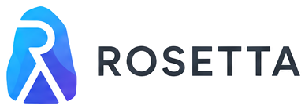

<p align="center">
  <a href="https://github.com/Choyeon/Rosetta">
    <picture>
      <source media="(prefers-color-scheme: dark)"  srcset="./docs/assets/logo/rosetta-dark.png"/>
      <source media="(prefers-color-scheme: light)" srcset="./docs/assets/logo/rosetta-light.png"/>
      
    </picture>
  </a>
</p>

<p align="center">
  <strong>Full-stack blog CMS built with FastAPI + Astro 7 + Svelte 5</strong><br/>
  Async-first architecture. Type-safe end-to-end. Batteries included.
</p>

<p align="center">
  <a href="https://github.com/Choyeon/Rosetta/actions/workflows/ci.yml"></a>
  <a href="https://github.com/Choyeon/Rosetta/blob/main/LICENSE"></a>
  <a href="https://github.com/Choyeon/Rosetta"></a>
  <a href="https://github.com/Choyeon/Rosetta"></a>
  <a href="https://github.com/Choyeon/Rosetta"></a>
  <a href="https://github.com/Choyeon/Rosetta"></a>
  <a href="https://github.com/Choyeon/Rosetta"></a>
  <a href="https://github.com/Choyeon/Rosetta"></a>
  <a href="https://github.com/Choyeon/Rosetta"></a>
</p>

<p align="center">
  <a href="https://vercel.com/new/clone?repository-url=https%3A%2F%2Fgithub.com%2FChoyeon%2FRosetta&project-name=rosetta-blog&repository-name=rosetta-blog">
    
  </a>
</p>

---

## Architecture

```
┌───────────────────────────────────────────────────────────────────────────┐
│                               Browser / App                               │
│   ──────  HTTPS / WSS  ──────  reverse-proxy  ─────────────────────────── │
└───────────────────────────────────────────────────────────────────────────┘
         │                                                │
         ▼                                                │
  ┌───────────────────────────────┐                        │
  │  Astro 7  Static + SSR Mix    │                        │
  │  ├─ Tailwind v4  design       │                        │
  │  └─ Svelte 5  islands (runes) │─── /api, /media ──────┘
  └───────────────┬───────────────┘
                  │
                  ▼
  ┌─────────────────────────────────────────────────────┐
  │  FastAPI + SQLAlchemy Async                         │
  │  ├─ JWT + CSRF + HSTS + Rate limit                  │
  │  ├─ ORM parameterized queries end-to-end            │
  │  └─ OpenAPI auto-docs: /docs  /redoc  /health       │
  └──────────────────┬─────────────────────┬────────────┘
                     │                     │
                     ▼                     ▼
              ┌────────────┐        ┌──────────────┐
              │  Database  │        │    Cache     │
              │ PG / SLite │        │ Redis / Mem  │
              └────────────┘        └──────────────┘
```

---

| | |
|---|---|
| **User System**<br/>Multi-role RBAC (superadmin / staff / subscriber). JWT access + refresh tokens. QQ / GitHub avatar fallback. Password-strength policy. Ban / soft-delete. Bulk operations via admin data-table. | **Comment System**<br/>Anonymous + Authenticated dual pipeline. Nested multi-level replies. Sensitivity analysis with optional approval. Original-content XSS storage + frontend escape. Reactions (like/dislike). Batch moderation API. |
| **Navigation Tree**<br/>Unlimited-depth hierarchy. Drag-and-drop reorder. Multiple node types: external link / archive / category / tag / page. Icon + target + rel=nofollow controls. | **Post Editor**<br/>Split-pane Markdown + live preview. Category / tag chips. Cover picker (upload / url / auto-extract). Series grouping. Scheduled publishing. Password / token encrypt. SEO meta. Revisions + recycle bin. |
| **Presentational**<br/>Astro Islands on-demand hydration. Tailwind v4. Dark / light / system theme. Sakura & canvas bg effects. Live2D + Spine models. One-click code-copy. Pagefind **offline** full-text search. | **Pages**<br/>Gallery (auto avif/webp + LQIP). Bangumi (sync via API). Timeline dynamics. Guestbook. Category / Tag archives. Friends links. Sponsor QR. |
| **Admin Console**<br/>`/admin` SPA-style dashboard. Stat cards. CRUD for posts / categories / tags / nav / albums / dynamics / announcements / banners / friends / settings. | **i18n · Security · Deployment**<br/>6 built-in locales with type-safe `i18nKey`.<br/>CSRF double-submit, HSTS/CSP/XFO headers, rate-limited auth, bcrypt+salt.<br/>`docker compose up -d`, Cloudflare Workers, Vercel button. |

---

## Quick Start

### Prerequisites

| Tool | Version | Install |
|---|---|---|
| Python | 3.12+ | [python.org](https://www.python.org) |
| `uv` | latest | [docs.astral.sh](https://docs.astral.sh/uv/getting-started/installation/) |
| Node.js | 22+ | [nodejs.org](https://nodejs.org) |
| `pnpm` | 10+ | `corepack enable && corepack prepare pnpm@10 --activate` |
| SQLite | bundled | (zero-config default) |

### 1. Backend

```bash
git clone https://github.com/Choyeon/Rosetta.git
cd Rosetta
uv sync
cp .env.example .env
uv run python -m backend.migrations upgrade
uv run uvicorn backend.main:app --reload --port 8000
```

| Endpoint | URL |
|---|---|
| Swagger UI | <http://localhost:8000/docs> |
| ReDoc      | <http://localhost:8000/redoc> |
| Health     | <http://localhost:8000/health> |

### 2. Frontend

```bash
cd frontend
pnpm install
pnpm dev
```

Open <http://localhost:4321> — the OOBE wizard guides you through DB config, admin creation, and seed content.

---

## Docker (recommended for production)

```bash
cp .env.example .env   # tweak SECRET_KEY / DB_PASSWORD / CORS_ORIGINS
docker compose up -d
```

| Service | URL / Address |
|---|---|
| Frontend (Nginx) | <http://localhost> |
| Backend API      | <http://localhost:8000> |
| PostgreSQL       | `localhost:5432` |
| Redis            | `localhost:6379` |

---

## Project Layout

```
rosetta/
├── backend/                 FastAPI application
│   ├── api/                 routes by domain
│   ├── core/                config / db / auth / cache / i18n / security
│   ├── middleware/          performance / logging / HSTS
│   ├── migrations/          Alembic revisions (18+ versions)
│   ├── models/              SQLAlchemy ORM
│   ├── repositories/        data-access layer
│   ├── schemas/             Pydantic request / response
│   ├── services/            business logic
│   ├── docs/                API reference + error codes
│   └── main.py              entry
├── frontend/                Astro 7 + Svelte 5
│   ├── src/
│   │   ├── api/             typed TS client
│   │   ├── components/      Astro + Svelte (full admin/*)
│   │   ├── config/          site configuration modules
│   │   ├── content/         Markdown / MDX collections
│   │   ├── i18n/            translations + i18nKey types
│   │   ├── layouts/
│   │   ├── pages/           file-system routing incl. /admin/*
│   │   └── plugins/         remark / rehype pipeline
│   ├── public/              static assets (favicon, fonts, Live2D/Spine)
│   ├── scripts/             build-time scripts (LQIP, font-subset)
│   └── astro.config.mjs
├── docs/assets/logo/        rosetta-icon.png, rosetta-light.png, rosetta-dark.png
├── docker/                  nginx.conf + entrypoint
├── Dockerfile               multi-stage build
├── docker-compose.yml
├── .env.example
└── DEPLOY.md
```

---

## Testing

```bash
# Backend — 326 cases passing
uv run pytest -q

# Frontend — all green
cd frontend
pnpm biome check ./src
pnpm astro check
CF_WORKERS=1 pnpm build
```

### Default admin (dev mode with OOBE skip)

| | |
|---|---|
| Username | `admin` |
| Password | `Admin123456` |

**Change it immediately in production.**

---

## Documentation

- [Deployment Guide](DEPLOY.md) — systemd / Nginx / PostgreSQL walkthrough
- [Backend API Reference](backend/docs/api_reference.md)
- [Error Codes](backend/docs/error_codes.md)
- [Contributing](frontend/CONTRIBUTING.md)

## License

MIT
